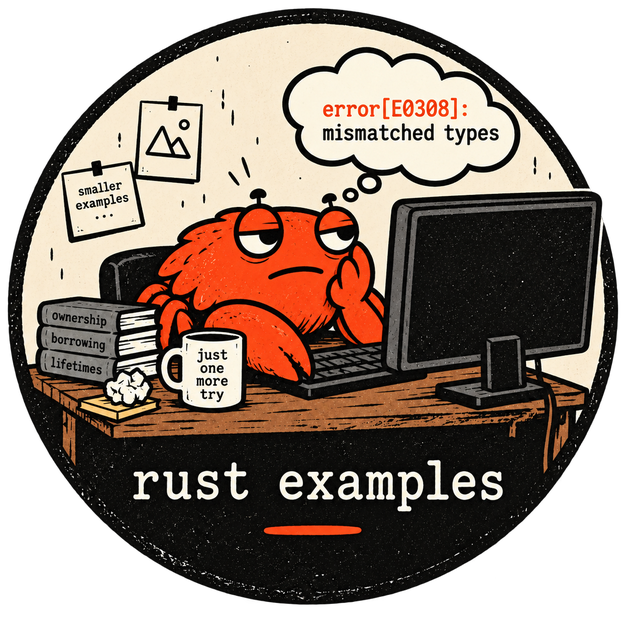

<p align="center">
  
</p>

# Rust Practice Hub

This repository contains various Rust code examples to demonstrate different concepts and features in the Rust programming language.

## Why?

I created these examples for the sheer fun of exploring Rust and learning more about this excellent programming language.

Feel free to use these examples to learn Rust or as a reference for your own projects. If you find any issues or have ideas for improvement, I'd be happy to receive contributions and feedback.

## How to Contribute

Contributions are welcome! If you have any interesting Rust examples, bug fixes, or enhancements, feel free to submit a pull request. Let's collaborate and build a collection of useful and educational Rust examples together.

## Usage

Each directory contains an example showcasing a specific topic in Rust. Click on the links to navigate to the respective examples and learn more about them.

## Building and testing

All examples are members of one Cargo workspace, so you can build or test everything from the repository root:

```bash
cargo build --workspace
cargo test --workspace
cargo clippy --workspace --all-targets -- -D warnings
```

### Clippy

[Clippy](https://doc.rust-lang.org/clippy/) is Rust's official linter. It catches common mistakes and suggests more idiomatic code. Every example in this repository passes Clippy with warnings treated as errors (`-D warnings`), and CI runs it on every pull request and every push to `main`, so a new warning fails the build.

Many warnings can be fixed automatically:

```bash
cargo clippy --fix --workspace --all-targets
```

If Clippy flags something that is intentional, allow that one lint where it happens (for example `#[allow(clippy::needless_return)]`) and add a comment explaining why. Don't turn lints off for the whole repository.

To work on a single example, run Cargo inside its directory or pass `-p <package-name>` from the root.

Three examples are kept out of the workspace build:

- [Mini](./mini/) needs LLVM 16 installed (see its README).
- [Hello asm](./asm/hello_asm/) contains platform-specific inline assembly.
- [No Std Call Libc Functions](./no_std_call_libc_functions/) needs its own `panic = "abort"` build profile, which Cargo ignores for workspace members.

Build those from their own directories. They are checked with Clippy in CI as well.

# AWS examples
- [simple-aws-lambda](./aws-lambda-example-hello-world/): Very basic AWS Lambda example in Rust.
- [aws-lambda-example-db](./aws-lambda-example-db/): Serverless user-management API on AWS Lambda with DynamoDB, login and token refresh flows, and a SAM template.

# Examples without category

- [Borrowing](./borrowing/): Demonstrates borrowing and ownership concepts in Rust.
- [Borrowing various other example](./borrowing-various-aspects/): Demonstrates borrowing and ownership concepts.
- [Borrowing Ownership Moves](./borrowing_ownership_moves/): Illustrates the movement of ownership between variables in Rust.
- [Closures and Anonymous Functions](./closures_anonymous_functions/): Shows the usage of closures and anonymous functions in Rust.
- [No Std Call Libc Functions](./no_std_call_libc_functions/): Uses libc functions in a `no_std` environment.
- [Raw Pointers](./raw_pointers/): Demonstrates the usage of raw pointers in Rust.
- [Threads](./threads/): Shows how to use threads for concurrent execution.
- [Tic Tac Toe console game](./tic-tac-toe/): Simple Tic Tac Toe game in Rust.
- [Test minifb - Human Face mouse follower](./test-minifb/): Abstract human face follow the mouse movment in a window.

# Assembly
- [Hello asm](./asm/hello_asm/): Prints "Hello, world!" using inline assembly (`asm!`) on macOS x86_64, macOS Apple Silicon and Windows x86_64.

# Smart pointers
- [Box and Arc](./smart-pointers/box-and-arc/): Shows `Box<T>` for recursive types and trait objects, and `Arc<T>` / `Arc<Mutex<T>>` for sharing data between threads.

# Design patterns
Design patterns are proven, reusable solutions to problems that come up again and again when designing software. Each example below explains its pattern in plain language with an everyday analogy, shows a small runnable program, and points out what's different when you write it in Rust.

**Creational** — how objects get created
- [Factory Pattern](./design-patterns/creational/factory-pattern/): One place that decides which kind of robot to build.
- [Abstract Factory Pattern](./design-patterns/creational/abstract-factory-pattern/): Families of related objects (fruits and vegetables) created through a common interface.
- [Builder Pattern](./design-patterns/creational/builder-pattern/): Building complex spacecraft step by step.
- [Singleton Pattern](./design-patterns/creational/singleton-pattern/): One shared app configuration and a thread-safe global ID counter, using `OnceLock` and atomics.

**Structural** — how objects fit together
- [Adapter Pattern](./design-patterns/structural/adapter-pattern/): Making an old Fahrenheit sensor library fit an app that expects Celsius.
- [Decorator Pattern](./design-patterns/structural/decorator-pattern/): Adding milk, sugar and cream to a coffee by wrapping it, layer by layer.
- [Facade Pattern](./design-patterns/structural/facade-pattern/): One "leave home" button that controls the lights, heating, door lock and alarm.
- [Proxy Pattern](./design-patterns/structural/proxy-pattern/): A caching stand-in for a slow exchange-rate service.
- [Composite Pattern](./design-patterns/structural/composite-pattern/): Files and folders, where a folder answers by asking everything inside it.

**Behavioral** — how objects work together and share responsibilities
- [Command Pattern](./design-patterns/behavioral/command-pattern/): Turning actions into objects, shown with the Mars Rover kata.
- [Strategy Pattern](./design-patterns/behavioral/strategy-pattern/): Estimating travel time by car, bike or on foot, swapped at runtime.
- [Observer Pattern](./design-patterns/behavioral/observer-pattern/): A weather station notifying every subscribed display.
- [State Pattern](./design-patterns/behavioral/state-pattern/): An online order moving from pending to paid, shipped and delivered, with Rust enums.
- [Iterator Pattern](./design-patterns/behavioral/iterator-pattern/): A playlist you can loop over, and an endless Fibonacci sequence, using Rust's built-in `Iterator` trait.
- [Template Method Pattern](./design-patterns/behavioral/template-method-pattern/): One report recipe, exported as CSV, Markdown or plain text.
- [Chain of Responsibility Pattern](./design-patterns/behavioral/chain-of-responsibility-pattern/): Expense approval passed up from team lead to director.
- [Memento Pattern](./design-patterns/behavioral/memento-pattern/): Undo and redo in a small text editor.

# Generics
- [Simple example](./generics/generic_storage/): Shows how to use generics in Rust.

# Math examples
- [Basic Calorie Calculator](./math/bmr-calculator/): It shows how math operators can be used in Rust.
- [Imperative & Declarative paradigm - Fibonacci algorithm](./math/fibonacci/): Imperative & Declarative paradigm example.

# Data processing
- [CSV](./data-processing/csv-processing/): Basic implementation of CSV processing and a data pipeline.

# Data structures
Written from scratch with detailed doc comments, ASCII diagrams and complexity tables. See the [data structures overview](./data-structures/) for a suggested learning order.

The Stack and Linked list examples are also **optimised**. Their READMEs explain how the data is stored in memory and how the CPU processes it.

- Linear: [Stack](./data-structures/linear/stack/), [Queue (ring buffer)](./data-structures/linear/queue/), [Linked list](./data-structures/linear/linked-list/), [Doubly linked list](./data-structures/linear/doubly-linked-list/)
- Trees: [Binary search tree](./data-structures/trees/binary-search-tree/), [AVL tree](./data-structures/trees/avl-tree/), [Trie](./data-structures/trees/trie/)
- Heaps: [Binary heap](./data-structures/heaps/binary-heap/)
- Hashing: [Hash table](./data-structures/hashing/hash-table/), [LRU cache](./data-structures/hashing/lru-cache/), [Hash map memory allocation](./data-structures/hashing/hash-map-memory-allocation/)
- Sets: [Union-find](./data-structures/sets/union-find/), [Bloom filter](./data-structures/sets/bloom-filter/)
- Graphs: [Graph with BFS/DFS](./data-structures/graphs/graph/), [Dijkstra's shortest path](./data-structures/graphs/dijkstra/), [Topological sort](./data-structures/graphs/topological-sort/)

# Functional programming
- [Functional Programming short docs](./functional_programming/): Couple of words about functional programming paradigm.
- [Concept of Pure Functions](./functional_programming/pure-function-basic/): Filtering Even Numbers example.
- [Immutability](./functional_programming/immutability/): Couple examples of immutability in Rust.
- [Higher Order Functions](./functional_programming/higher-order-functions/): Couple examples for Higher Order Functions in Rust.
- [Function composition](./functional_programming/function-composition/): Couple examples for Function composition in Rust.

# Network
- [Simple HTTP server](./network/basic-http-server/): It shows how to create a very simple HTTP server in Rust without using external library.

# Streams
- [Simple streaming](./streams/sensor_stream/): It shows how to create a very simple HTTP sensor data writing and reading solution.

# Programming fun
- [Mini](./mini/): Mini programming language designed in Rust. It shows how can we use LLVM in Rust.
