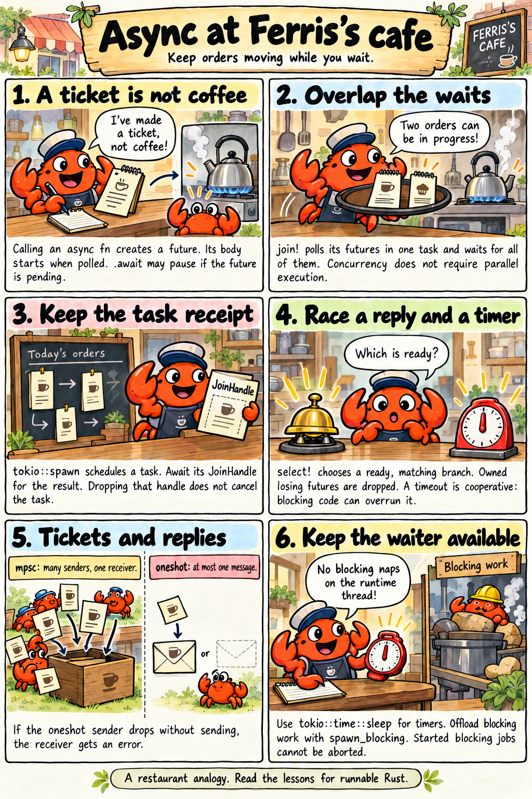
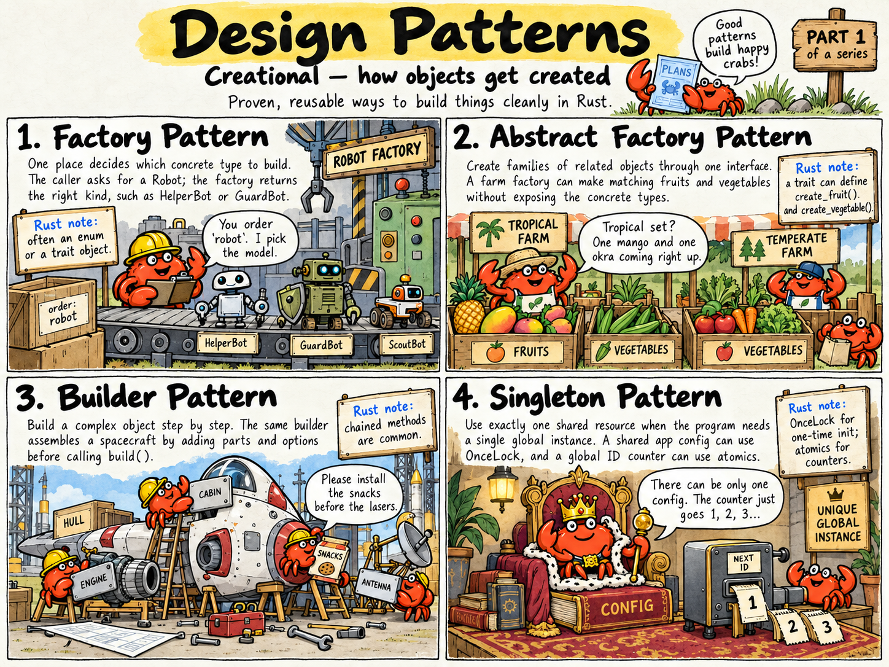
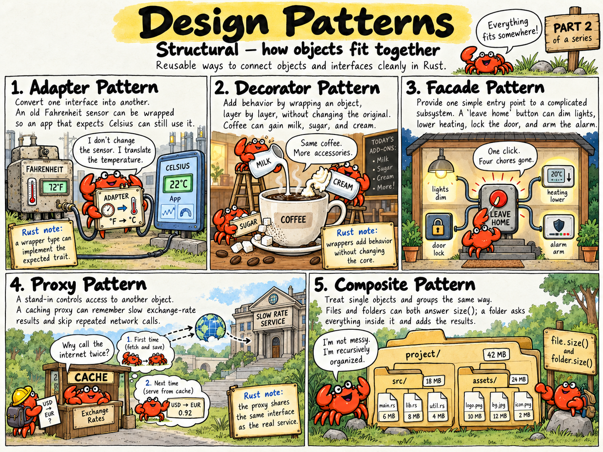
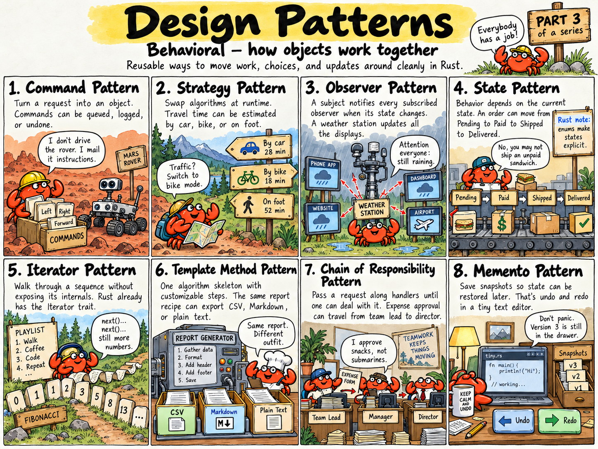

<p align="center">
  
</p>

# Rust Practice Hub

A place to learn Rust: step-by-step **lessons** for people who want to learn the language, and standalone **examples** to look things up in.

## Why?

I've been a software developer for more than 25 years, in many different industries. I've used Rust since its very first public appearance, and I still keep learning every single day. I started this repository in 2023 as a collection of Rust examples, for the sheer fun of exploring Rust and learning more about this excellent programming language.

It has since grown into something more. Today I write it for people who **want to learn Rust**: to share good practices, and to help junior developers get past the parts of Rust that feel hard at first, like ownership, borrowing, lifetimes and error handling. That's why you'll find two kinds of content here.

## Lessons and examples

| | **Lessons** | **Examples** |
|---|---|---|
| what | a numbered course, like `01-…`, `02-…`, that teaches one subject step by step | one standalone program that shows one thing |
| how to read | in order: each lesson builds on the ones before it | in any order: jump straight to what you need |
| the README | explains the *why*, with real compiler errors and an "idea in one sentence" | explains what the program does and how to run it |
| good for | learning a subject properly | a quick reference, or a starting point for your own code |

**The courses**, with lessons:
- [Ownership and borrowing](./ownership-and-borrowing/), [Error handling](./error-handling/), [Traits and generics](./traits-and-generics/), [Closures and iterators](./closures-and-iterators/)
- [Async / await](./async-await/), [Concurrency with threads](./concurrency/), [Macros](./macros/), [no_std and bare-metal Rust](./no-std-and-bare-metal/)
- [Data processing](./data-processing/), [Software engineering with AI](./software-engineering-with-ai/)

**The examples:**
- [Design patterns](./design-patterns/) and [data structures](./data-structures/): organised by category, each one standalone;
- the smaller examples further down this page;
- [Mini](./mini/), a tiny programming language, which is a project of its own.

Every lesson and example is checked in CI: it builds, its tests pass, and Clippy has no warnings. Compiler errors quoted in the lessons are the real output of the compiler.

If you find any issues or have ideas for improvement, I'd be happy to receive contributions and feedback.

## How to Contribute

Contributions are welcome! If you have a Rust example, a lesson idea, a bug fix or an improvement, feel free to submit a pull request. Let's build a collection that helps people learn Rust, together.

## Building and testing

All lessons and examples are members of one Cargo workspace, so you can build or test everything from the repository root:

```bash
cargo build --workspace
cargo test --workspace
cargo clippy --workspace --all-targets -- -D warnings
```

### Clippy

[Clippy](https://doc.rust-lang.org/clippy/) is Rust's official linter. It catches common mistakes and suggests more idiomatic code. Every lesson and example in this repository passes Clippy with warnings treated as errors (`-D warnings`), and CI runs it on every pull request and every push to `main`, so a new warning fails the build.

Many warnings can be fixed automatically:

```bash
cargo clippy --fix --workspace --all-targets
```

If Clippy flags something that is intentional, allow that one lint where it happens (for example `#[allow(clippy::needless_return)]`) and add a comment explaining why. Don't turn lints off for the whole repository.

To work on a single example, run Cargo inside its directory or pass `-p <package-name>` from the root.

A few examples are kept out of the workspace build:

- [Mini](./mini/) needs any LLVM 16 or newer installed (see its README).
- [Hello asm](./asm/hello_asm/) contains platform-specific inline assembly.
- Lessons 1 and 3 of the [no_std course](./no-std-and-bare-metal/) need their own `panic = "abort"` build profile, which Cargo ignores for workspace members, and lesson 5 builds only for WebAssembly.

Build those from their own directories. They are checked with Clippy in CI as well.

# Ownership and borrowing
A twelve-lesson course on how Rust manages memory without a garbage collector. Every README explains one idea simply and precisely, and every compiler error it quotes is real. Start with the [course overview](./ownership-and-borrowing/).

<p align="center">
  <a href="./ownership-and-borrowing/ownership-and-borrowing-comic.png">
    
  </a>
</p>

1. [Ownership and moves](./ownership-and-borrowing/01-ownership-and-moves/): move vs copy vs clone, and when values are dropped.
2. [References](./ownership-and-borrowing/02-references/): `&` and `&mut`, and methods taking `&self`, `&mut self` or `self`.
3. [The borrowing rules](./ownership-and-borrowing/03-borrowing-rules/): many readers or one writer, and why.
4. [Slices](./ownership-and-borrowing/04-slices/): `&str` and `&[T]`, borrowing part of a collection.
5. [Lifetimes](./ownership-and-borrowing/05-lifetimes/): dangling references and `'a` annotations.
6. [Borrowing in practice](./ownership-and-borrowing/06-borrowing-in-practice/): struct fields, loops, closures, `split_at_mut`, `get_disjoint_mut`, `mem::take`.
7. [Interior mutability](./ownership-and-borrowing/07-interior-mutability/): `Cell`, `RefCell` and `Rc<RefCell<T>>`.
8. [Threads and borrowing](./ownership-and-borrowing/08-threads-and-borrowing/): no data races, `Send` and `Sync`, scoped threads, `Arc` and `Mutex`.
9. [Borrowing in patterns](./ownership-and-borrowing/09-borrowing-in-patterns/): `match` on references, partial moves, `as_ref`.
10. [Advanced lifetimes](./ownership-and-borrowing/10-advanced-lifetimes/): several lifetimes, `dyn Trait + 'a`, `impl Trait + use<>`.
11. [Cow and the borrowing traits](./ownership-and-borrowing/11-cow-and-borrowing-traits/): `Cow`, `Borrow`, `AsRef`, `Deref`.
12. [Where the borrow checker is too strict](./ownership-and-borrowing/12-borrow-checker-limits/): correct code it rejects, and the workarounds, including `push_mut`.

# Error handling
A five-lesson course on how Rust handles failure without exceptions, from `panic!` to production-quality error types. Start with the [course overview](./error-handling/).

<p align="center">
  <a href="./error-handling/error-handling-comic.png">
    
  </a>
</p>

1. [panic vs Result](./error-handling/01-panic-vs-result/): bugs vs expected failures, `unwrap`, `expect`, safe fallbacks, and overflow: `checked_*` vs `strict_*`.
2. [The `?` operator](./error-handling/02-the-question-mark/): passing errors up, `ok_or`, `map_err`, `Box<dyn Error>`.
3. [Custom error types](./error-handling/03-custom-error-types/): error enums, `Display`, `source()` chains, `From`, testing with `assert_matches!`.
4. [thiserror and anyhow](./error-handling/04-thiserror-and-anyhow/): the same without boilerplate; library vs application errors.
5. [Everyday patterns](./error-handling/05-error-handling-patterns/): combinators, many results at once, `let … else`, let chains, `if let` guards, retrying.

# Traits and generics
A six-lesson course on writing code that works with many types, without inheritance. Start with the [course overview](./traits-and-generics/).

1. [Traits](./traits-and-generics/01-traits/): defining and implementing traits, default methods, `impl Trait`, `derive`.
2. [Generics](./traits-and-generics/02-generics/): generic functions and types, trait bounds, monomorphisation.
3. [Trait objects](./traits-and-generics/03-trait-objects/): `dyn Trait`, vtables, static vs dynamic dispatch, upcasting to a supertrait.
4. [Associated types and constants](./traits-and-generics/04-associated-types/): `type Item`, `const`, and generic traits.
5. [The standard traits](./traits-and-generics/05-standard-traits/): `Display` (also from a closure with `fmt::from_fn`), `Eq`, `Ord`, `Hash`, `Default`, `From`, operators.
6. [Advanced traits](./traits-and-generics/06-advanced-traits/): supertraits, blanket impls, the orphan rule, extension traits.

# Async / await
A five-lesson course on async Rust with tokio: one thread, many tasks. Start with the [course overview](./async-await/).

<p align="center">
  <a href="./async-await/async-await-comic.png">
    
  </a>
</p>

1. [What async is](./async-await/01-what-is-async/): futures, `.await`, polling, runtimes, async vs threads.
2. [Running things concurrently](./async-await/02-running-concurrently/): `join!`, `tokio::spawn`, `JoinSet`, async closures and `AsyncFn`.
3. [select and timeouts](./async-await/03-select-and-timeouts/): racing futures, deadlines, cancellation.
4. [Channels and shared state](./async-await/04-channels-and-shared-state/): `mpsc`, `oneshot`, `Arc<Mutex<T>>`.
5. [Async pitfalls](./async-await/05-async-pitfalls/): blocking the runtime, locks across `.await`, recursion.

# Macros
A four-lesson course on code that writes code. Start with the [course overview](./macros/).

1. [`macro_rules!` basics](./macros/01-macro-rules-basics/): patterns, templates, fragment types, hygiene.
2. [Repetition](./macros/02-repetition/): `$( … ),*`, optional parts, recursive macros.
3. [Macros that generate code](./macros/03-generating-code/): one `impl` for many types, generated tests.
4. [A derive macro](./macros/04-derive-macro/): a real `#[derive(Describe)]` procedural macro with `syn` and `quote`.

# Closures and iterators
A five-lesson course on closures and iterators, from capturing variables to writing your own iterator adapters. Start with the [course overview](./closures-and-iterators/).

1. [Closures](./closures-and-iterators/01-closures/): syntax, capturing, unique closure types, function pointers.
2. [`Fn`, `FnMut` and `FnOnce`](./closures-and-iterators/02-fn-traits/): which closure implements which, and which to ask for.
3. [Storing and returning closures](./closures-and-iterators/03-storing-and-returning-closures/): `impl Fn`, `Box<dyn Fn>`, callbacks, memoisation.
4. [The iterator toolbox](./closures-and-iterators/04-iterator-toolbox/): laziness, adapters, consumers, `collect` into anything, `array_windows`, `extract_if`.
5. [Writing your own iterators](./closures-and-iterators/05-writing-iterators/): `from_fn`, `impl Iterator`, `IntoIterator`, custom adapters.

# Concurrency with threads
A five-lesson course on fearless concurrency: threads, channels, locks, atomics and rayon. Start with the [course overview](./concurrency/).

1. [Threads](./concurrency/01-threads/): `spawn`, `join`, `move`, scoped threads, panics in threads.
2. [Message passing](./concurrency/02-message-passing/): `mpsc` channels, backpressure, a worker pool.
3. [Locks and condition variables](./concurrency/03-locks-and-condvars/): `Arc<Mutex<T>>`, poisoning, `RwLock`, `Condvar`, `Barrier`, file locks shared with other programs.
4. [Atomics](./concurrency/04-atomics/): lock-free counters, `compare_exchange`, memory ordering.
5. [Data parallelism with rayon](./concurrency/05-data-parallelism/): `par_iter`, parallel sort, measured speed-ups.

# no_std and bare-metal Rust
A five-lesson course on Rust without the standard library: the code that runs on microcontrollers, in kernels and firmware, and in tiny WebAssembly modules. Every lesson runs on an ordinary computer. Start with the [course overview](./no-std-and-bare-metal/).

1. [Calling the C library](./no-std-and-bare-metal/01-calling-the-c-library/): `no_std` + `no_main`, safe wrappers around C functions, a variadic function written in Rust; a binary 6× smaller than `std`'s hello world.
2. [A core-only library](./no-std-and-bare-metal/02-core-only-library/): fixed-capacity collections, CRC-32 at compile time, parsing binary packets, formatting without a heap.
3. [A custom allocator](./no-std-and-bare-metal/03-custom-allocator/): a bump allocator that brings back `Vec`, `String` and `format!`.
4. [Memory-mapped registers](./no-std-and-bare-metal/04-memory-mapped-registers/): volatile access, register layouts, bit fields and a UART driver.
5. [WebAssembly without an OS](./no-std-and-bare-metal/05-webassembly-without-an-os/): an 801-byte module with no imports, run from Node.js.

# Software engineering with AI
A ten-lesson course on writing software when AI can write much of the code: what vibe coding is and isn't, prompting, why programmers still need to know their craft, why Rust is a great fit for AI-driven development, why fewer dependencies are safer, why clippy and tests belong in every project from day one, and the shadow side: why people should still learn to read, calculate and code. It's written in October 2026, and the AI industry changes every day, so read it critically: what's true today might not be true tomorrow. Start with the [course overview](./software-engineering-with-ai/).

1. [What is vibe coding?](./software-engineering-with-ai/01-what-is-vibe-coding/): accepting AI code without reading it; when that's fine and when it's dangerous.
2. [AI-assisted engineering](./software-engineering-with-ai/02-ai-assisted-engineering/): the human sets the direction and checks the work; real examples from building this repository.
3. [Prompting](./software-engineering-with-ai/03-prompting/): a prompt is a specification, and you can only ask for what you can name.
4. [Why you still need to know](./software-engineering-with-ai/04-why-you-still-need-to-know/): plausible AI-style Rust next to good Rust, and the tests that tell them apart.
5. [Why Rust fits AI-assisted development](./software-engineering-with-ai/05-why-rust-fits-ai/): the compiler as a tireless reviewer, and the honest downsides.
6. [Clippy and tests as guardrails](./software-engineering-with-ai/06-clippy-and-tests-as-guardrails/): what clippy catches, stricter lints, and tests that check intent instead of copying output.
7. [From day one, or later?](./software-engineering-with-ai/07-from-day-one-or-later/): a five-minute setup, the prototype exception, and adding checks to old code.
8. [Fewer dependencies](./software-engineering-with-ai/08-fewer-dependencies/): every package is a decision; what AI changes; how to check what you depend on.
9. [Reviewing AI-written code](./software-engineering-with-ai/09-reviewing-ai-code/): a checklist for code you didn't write.
10. [The shadow side](./software-engineering-with-ai/10-the-shadow-side/): fading skills, the learning paradox, and why the basics matter more with AI, not less.

# AWS examples
- [simple-aws-lambda](./aws-lambda-example-hello-world/): Very basic AWS Lambda example in Rust.
- [aws-lambda-example-db](./aws-lambda-example-db/): Serverless user-management API on AWS Lambda with DynamoDB, login and token refresh flows, and a SAM template.

# Examples without category

- [Closures and Anonymous Functions](./closures_anonymous_functions/): Shows the usage of closures and anonymous functions in Rust. For much more, see the [Closures and iterators course](./closures-and-iterators/).
- [Raw Pointers](./raw_pointers/): Demonstrates the usage of raw pointers in Rust.
- [Threads](./threads/): Shows how to use threads for concurrent execution. For much more, see the [Concurrency course](./concurrency/).
- [Tic Tac Toe console game](./tic-tac-toe/): Simple Tic Tac Toe game in Rust.
- [Test minifb - Human Face mouse follower](./test-minifb/): Abstract human face follow the mouse movment in a window.

# Assembly
- [Hello asm](./asm/hello_asm/): Prints "Hello, world!" using inline assembly (`asm!`) on macOS x86_64, macOS Apple Silicon and Windows x86_64, plus a naked function written entirely in assembly, chosen per platform with `cfg_select!`.

# Smart pointers
- [Box and Arc](./smart-pointers/box-and-arc/): Shows `Box<T>` for recursive types and trait objects, and `Arc<T>` / `Arc<Mutex<T>>` for sharing data between threads.

# Design patterns
Design patterns are proven, reusable solutions to problems that come up again and again when designing software. Each example below explains its pattern in plain language with an everyday analogy, shows a small runnable program, and points out what's different when you write it in Rust. See the [design patterns overview](./design-patterns/) for all of them with their comics.

**Creational** — how objects get created

<p align="center">
  <a href="./design-patterns/creational-patterns-comic.png">
    
  </a>
</p>

- [Factory Pattern](./design-patterns/creational/factory-pattern/): A robot factory: you order by job, and it picks the model.
- [Abstract Factory Pattern](./design-patterns/creational/abstract-factory-pattern/): Tropical and temperate farms that each make a matching fruit and vegetable.
- [Builder Pattern](./design-patterns/creational/builder-pattern/): Building complex spacecraft step by step.
- [Singleton Pattern](./design-patterns/creational/singleton-pattern/): One shared app configuration and a thread-safe global ID counter, using `OnceLock` and atomics.

**Structural** — how objects fit together

<p align="center">
  <a href="./design-patterns/structural-patterns-comic.png">
    
  </a>
</p>

- [Adapter Pattern](./design-patterns/structural/adapter-pattern/): Making an old Fahrenheit sensor library fit an app that expects Celsius.
- [Decorator Pattern](./design-patterns/structural/decorator-pattern/): Adding milk, sugar and cream to a coffee by wrapping it, layer by layer.
- [Facade Pattern](./design-patterns/structural/facade-pattern/): One "leave home" button that controls the lights, heating, door lock and alarm.
- [Proxy Pattern](./design-patterns/structural/proxy-pattern/): A caching stand-in for a slow exchange-rate service.
- [Composite Pattern](./design-patterns/structural/composite-pattern/): Files and folders, where a folder answers by asking everything inside it.

**Behavioral** — how objects work together and share responsibilities

<p align="center">
  <a href="./design-patterns/behavioral-patterns-comic.png">
    
  </a>
</p>

- [Command Pattern](./design-patterns/behavioral/command-pattern/): Turning actions into objects, shown with the Mars Rover kata.
- [Strategy Pattern](./design-patterns/behavioral/strategy-pattern/): Estimating travel time by car, bike or on foot, swapped at runtime.
- [Observer Pattern](./design-patterns/behavioral/observer-pattern/): A weather station notifying every subscribed display.
- [State Pattern](./design-patterns/behavioral/state-pattern/): An online order moving from pending to paid, shipped and delivered, with Rust enums.
- [Iterator Pattern](./design-patterns/behavioral/iterator-pattern/): A playlist you can loop over, and an endless Fibonacci sequence, using Rust's built-in `Iterator` trait.
- [Template Method Pattern](./design-patterns/behavioral/template-method-pattern/): One report recipe, exported as CSV, Markdown or plain text.
- [Chain of Responsibility Pattern](./design-patterns/behavioral/chain-of-responsibility-pattern/): Expense approval passed up from team lead to director.
- [Memento Pattern](./design-patterns/behavioral/memento-pattern/): Undo and redo in a small text editor.

# Generics
- [Simple example](./generics/generic_storage/): Shows how to use generics in Rust. For the full picture, see the [Traits and generics course](./traits-and-generics/).

# Math examples
- [Basic Calorie Calculator](./math/bmr-calculator/): It shows how math operators can be used in Rust.
- [Imperative & Declarative paradigm - Fibonacci algorithm](./math/fibonacci/): Imperative & Declarative paradigm example.

# Data processing
A nine-lesson course on reading, cleaning, summarising and reporting on data, following lab sensor readings from a CSV file to a parallel pipeline, live network data, joins and time windows. Start with the [course overview](./data-processing/).

1. [CSV by hand](./data-processing/01-csv-by-hand/): parsing into structs, quoted fields, failing loudly instead of silently.
2. [Big files: streaming](./data-processing/02-streaming-big-files/): a 60 MB file in about 1.7 MB of memory.
3. [Cleaning and validation](./data-processing/03-cleaning-and-validation/): units, missing values, impossible values, duplicates, and accounting for every row.
4. [Aggregation and statistics](./data-processing/04-aggregation-and-statistics/): group by, mean vs median, percentiles, moving averages.
5. [JSON with serde](./data-processing/05-json-with-serde/): typed JSON in and out, with precise error messages.
6. [A processing pipeline](./data-processing/06-processing-pipeline/): small stages, fold and merge, and the same code on every core with rayon.
7. [Live data over the network](./data-processing/07-live-data-over-the-network/): a TCP client and server that survive slow and missing servers, dropped connections, messy data, duplicates and losses, with authentication, authorization and bounded memory.
8. [Joining datasets](./data-processing/08-joining-datasets/): inner, left and anti joins, and why an index beats nested loops.
9. [Time and windows](./data-processing/09-time-and-windows/): timestamps as numbers, gaps in the data, tumbling windows.

# Data structures
Written from scratch with detailed doc comments, ASCII diagrams and complexity tables. See the [data structures overview](./data-structures/) for a suggested learning order.

The Stack and Linked list examples are also **optimised**. Their READMEs explain how the data is stored in memory and how the CPU processes it.

- Linear: [Stack](./data-structures/linear/stack/), [Queue (ring buffer)](./data-structures/linear/queue/), [Linked list](./data-structures/linear/linked-list/), [Doubly linked list](./data-structures/linear/doubly-linked-list/)
- Trees: [Binary search tree](./data-structures/trees/binary-search-tree/), [AVL tree](./data-structures/trees/avl-tree/), [Trie](./data-structures/trees/trie/)
- Heaps: [Binary heap](./data-structures/heaps/binary-heap/)
- Hashing: [Hash table](./data-structures/hashing/hash-table/), [LRU cache](./data-structures/hashing/lru-cache/), [Hash map memory allocation](./data-structures/hashing/hash-map-memory-allocation/)
- Sets: [Union-find](./data-structures/sets/union-find/), [Bloom filter](./data-structures/sets/bloom-filter/)
- Graphs: [Graph with BFS/DFS](./data-structures/graphs/graph/), [Dijkstra's shortest path](./data-structures/graphs/dijkstra/), [Topological sort](./data-structures/graphs/topological-sort/)

# Functional programming
- [Functional Programming short docs](./functional_programming/): Couple of words about functional programming paradigm.
- [Concept of Pure Functions](./functional_programming/pure-function-basic/): Filtering Even Numbers example.
- [Immutability](./functional_programming/immutability/): Couple examples of immutability in Rust.
- [Higher Order Functions](./functional_programming/higher-order-functions/): Couple examples for Higher Order Functions in Rust.
- [Function composition](./functional_programming/function-composition/): Couple examples for Function composition in Rust.

# Network
- [Simple HTTP server](./network/basic-http-server/): It shows how to create a very simple HTTP server in Rust without using external library.

# Programming fun
- [Mini](./mini/): Mini programming language designed in Rust. It shows how can we use LLVM in Rust.
