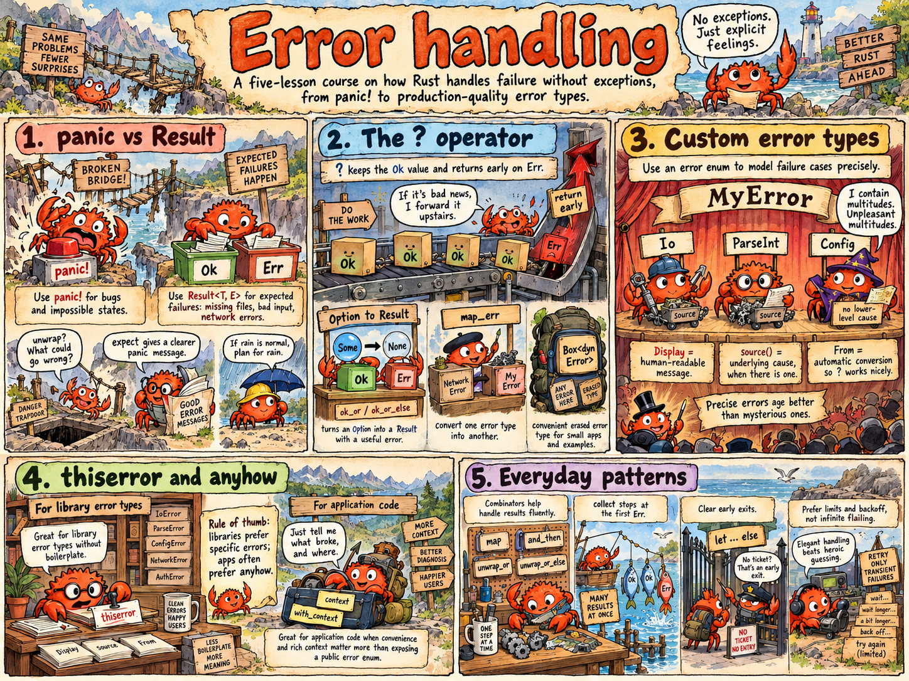

# Error Handling

<p align="center">
  <a href="error-handling-comic.png">
    
  </a>
</p>

Rust has no exceptions. A function that can fail says so in its return type, and the caller has to deal with it, so errors can't slip past unnoticed. This short course explains how that works and how to do it well, from `panic!` to production-quality error types.

Every compiler error, warning and panic message quoted in these READMEs is the real output of Rust 1.99.

## The lessons

| # | Lesson | You'll learn |
|---|---|---|
| 1 | [panic vs Result](01-panic-vs-result/) | bugs vs expected failures, `Result` and `Option`, `unwrap` / `expect` and safe fallbacks, overflow: `checked_*`, `saturating_*`, `wrapping_*`, `strict_*` |
| 2 | [The `?` operator](02-the-question-mark/) | what `?` expands to, errors travelling up, `ok_or` and `map_err`, `Box<dyn Error>`, `main` returning `Result` |
| 3 | [Custom error types](03-custom-error-types/) | error enums, `Display`, the `Error` trait, `source()` chains, `From` so `?` converts, testing with `assert_matches!` |
| 4 | [thiserror and anyhow](04-thiserror-and-anyhow/) | the same with no boilerplate; library vs application errors; `context`; printing chains |
| 5 | [Everyday patterns](05-error-handling-patterns/) | combinators, many results at once, `let … else`, let chains, `if let` guards, fallbacks, retrying |

## The core ideas on one page

```rust
enum Result<T, E> { Ok(T), Err(E) }    // success with a value, or failure with a reason
enum Option<T>    { Some(T), None }    // a value, or nothing
```

- **Bugs panic. Expected failures return `Result`.** If a user or the outside world can cause it, it's a `Result`.
- **`?` passes an error up** to the caller, converting it with `From` on the way.
- **Good error types are enums** with one variant per failure, a `Display` message for people, and a `source()` pointing to the cause.
- **Libraries** define precise error types (`thiserror`). **Applications** add context and report them (`anyhow`).

## Run a lesson

```bash
cd error-handling/02-the-question-mark
cargo run
cargo test
```

Or from the repository root: `cargo run -p question-mark-operator`. The package names are in each lesson's `Cargo.toml`.
