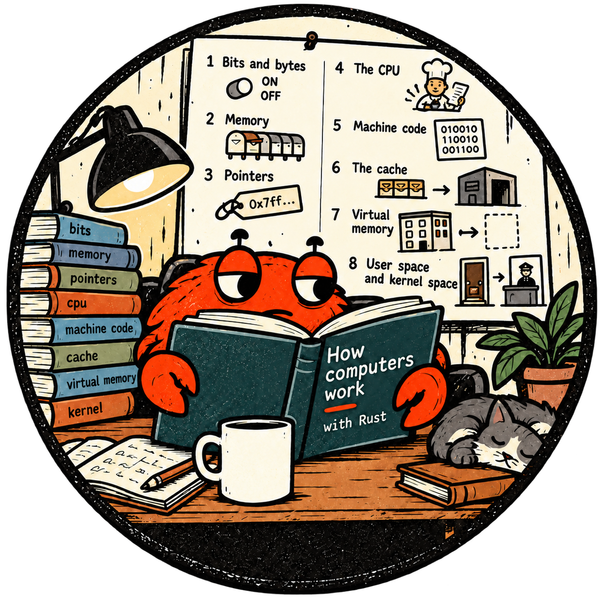

# How computers work: from bits to qubits

<p align="center">
  <a href="rust-how-computers-work.png">
    
  </a>
</p>

What happens when a computer runs a program? Start with **bits**, visit the CPU's kitchen and the Memory Hotel, and discover how Rust uses the machine safely. A final lesson explores **quantum computers** and the classical Rust tools that can support them.

This course is for children, curious learners and junior developers. You don't have to understand every technical word at once. Each lesson introduces its words with an example.

## How to explore

1. Read the everyday story: switches, mailboxes, recipe cards or hotel rooms.
2. Follow the worked example, then try the small question.
3. Run the Rust program and compare its output with your prediction.
4. Read the history: people invented these ideas to solve real problems.

The stories explain selected features; each lesson says where its picture stops. The technical sections distinguish **language guarantees**, **platform rules** and **observed results**.

## The lessons

| # | Lesson | Everyday picture | What you'll discover |
|---|---|---|---|
| 1 | [Bits and bytes](01-bits-and-bytes/) | Ferris's light-switch message board | Binary, signed integers, UTF-8, RGB and rounded floating-point numbers |
| 2 | [Memory and addresses](02-memory-and-addresses/) | A street of mailboxes | Virtual addresses, array spacing, byte order, alignment and padding |
| 3 | [Pointers are addresses](03-pointers-are-addresses/) | A slip saying where the treasure is | References, dereferencing, valid access and optional references |
| 4 | [A tiny CPU](04-a-tiny-cpu/) | A cook with recipe cards and four bowls | A Rust emulator: fetch, decode, execute, registers and jumps |
| 5 | [Real machine code](05-real-machine-code/) | Kitchens with different card languages | AArch64/x86-64 instructions, calling conventions and actual code bytes |
| 6 | [The cache](06-the-cache/) | A shelf, cupboard and warehouse | Cache lines, visiting order and the limits of timing experiments |
| 7 | [Virtual memory](07-virtual-memory/) | Guests' private room lists in a magic hotel | Pages, offsets, mappings, permissions, demand paging, swap and ASLR |
| 8 | [User space and kernel space](08-user-space-and-kernel-space/) | Requests at the hotel's front desk | Privilege, assembly/API requests, buffering and OS services |
| 9 | [Why Rust](09-why-rust/) | A workshop with a plan inspector and guards | Compile-time borrowing rules, run-time bounds checks and memory safety |
| 10 | [Quantum computing](10-quantum-computing/) | Ferris's ripple laboratory | Bits versus qubits, interference, measurement, entanglement, hardware and Rust's role |

Lesson 8 also has a [small hello-syscall companion](08-user-space-and-kernel-space/hello-syscall/). Lesson 10 contains a standalone Rust simulation in its README, rather than a new Cargo package.

## Run a lesson

Start at the repository root, then choose a lesson:

```bash
cd how-computers-work/04-a-tiny-cpu
cargo run
cargo test
```

For the measurements in **lessons 6–9**, use:

```bash
cargo run --release
```

Release builds enable optimisation. A debug build is useful for development, but its extra work can dominate these small benchmarks.

The examples were checked with **Rust 1.99.0** during this review. Lesson 5 requires an AArch64 or x86-64 target; lesson 8's companion supports Linux/macOS on those architectures and Windows. Read each lesson's run section for its assumptions.

Lesson 7 defaults to a **1 GiB** buffer; lesson 6 uses a **256 MiB** table; lesson 9 sums roughly **381 MiB** of data. Smaller computers may need smaller experiments. The READMEs explain the sizes and, where relevant, how to reduce them.

## How to read numbers and addresses

Sample timings come from Apple M2 runs where stated. They aren't promises: your hardware, compiler, settings and other running programs can change both the numbers and the ratios. The same experiment needn't show the same pattern on every machine.

Some quantities **are** fixed: eight bits in a Rust byte, four bytes in a `u32`. Others depend on a target: alignment and page size. Addresses printed by these programs are **virtual addresses**, and may change between runs.

Units matter:

| Unit | Meaning |
|---|---|
| ns | One billionth of a second |
| µs | One millionth of a second |
| ms | One thousandth of a second |
| KiB | 1,024 bytes |
| MiB | 1,048,576 bytes |
| GiB | 1,073,741,824 bytes |

The tests check example behaviour, not required performance. A passing test is evidence about its assertions on that build, not proof of every hardware or language claim.

## Related courses

- [Pointers and memory](../pointers-and-memory/): `Box`, `Rc`, `Arc` and raw pointers.
- [no_std and bare-metal Rust](../no-std-and-bare-metal/): code without an operating system.
- [Ownership and borrowing](../ownership-and-borrowing/): more practice with Rust's memory rules.
