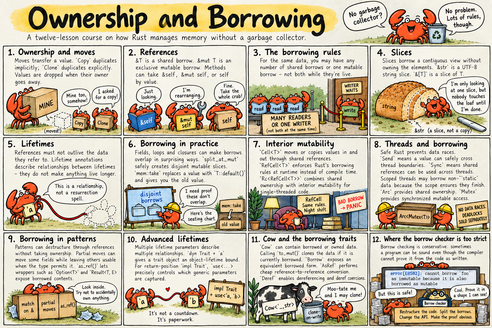

# Ownership and Borrowing

<p align="center">
  <a href="ownership-and-borrowing-comic.png">
    
  </a>
</p>

Think of Ferris lending a favourite book: who owns it, who may read it, and who may write notes in it? **Ownership** answers the first question; **borrowing** answers the others.

Rust can manage memory **without a garbage collector or manual `free`**. In safe Rust, these rules, lifetime checks and thread-safety traits prevent bugs such as dangling references, double frees and data races. Code using `unsafe` must uphold its own additional safety requirements.

This folder has twelve runnable lessons. The diagnostic excerpts were checked with Rust 1.99. Examples marked **does not compile** are puzzles: predict the problem, then compare the working version. Blocks labelled **signature** or **excerpt** show part of a larger program; the complete runnable lesson is in `src/main.rs`.

## All the rules on one page

**Ownership**

1. Ordinary owned values belong to a variable, field or collection.
2. Moving a non-`Copy` value transfers ownership. Its previous location cannot be read until it is reinitialised. `Copy` values are duplicated instead.
3. An owned value is normally dropped when its owner leaves scope. Assignment and explicit `drop` can drop it earlier.

`Rc` and `Arc` add **shared ownership of heap data**: each handle has its own owner, and the shared value is dropped when the last strong handle is dropped. Lesson 7 explains the distinction.

**Borrowing**

1. A reference gives access without taking ownership of the value it points to.
2. Ordinary data may be accessed through shared references (`&T`) or an exclusive mutable reference (`&mut T`). Reborrowing temporarily limits the original reference's access; different fields can be borrowed separately.
3. A borrow stays active for every use that requires it, including uses through copied references, closures or destructors. In simple examples, it ends at the reference's last use.
4. A usable reference must point to valid data for its lifetime.

A shared reference cannot directly change ordinary data. **Interior mutability** provides controlled ways to change selected contents through `&`; `Cell` and `RefCell` use different techniques. The later lessons explain these details.

## The lessons

| # | Lesson | You'll learn |
|---|---|---|
| 1 | [Ownership and moves](01-ownership-and-moves/) | move vs copy vs clone, functions taking and returning ownership, when values are dropped |
| 2 | [References](02-references/) | `&` and `&mut`, dereferencing with `*`, methods taking `&self`, `&mut self` or `self` |
| 3 | [The borrowing rules](03-borrowing-rules/) | "many readers or one writer", how long a borrow lasts, *why* the rule exists, reborrows |
| 4 | [Slices](04-slices/) | `&str` and `&[T]`, why functions should take them, byte positions in UTF-8 text |
| 5 | [Lifetimes](05-lifetimes/) | dangling references, `'a` annotations, the elision rules, structs holding references, `'static` |
| 6 | [Borrowing in practice](06-borrowing-in-practice/) | struct fields, `split_at_mut` and `get_disjoint_mut`, the three kinds of loop, closures, `mem::take` |
| 7 | [Interior mutability](07-interior-mutability/) | whole-value changes with `Cell`, runtime borrow checks with `RefCell`, shared ownership with `Rc` |
| 8 | [Threads and borrowing](08-threads-and-borrowing/) | how safe Rust prevents data races, `Send` and `Sync`, scoped threads, `Arc`, `Mutex`, `RwLock` |
| 9 | [Borrowing in patterns](09-borrowing-in-patterns/) | `match` and `if let` on references, `ref`, partial moves, `as_ref` / `as_mut` / `as_deref` |
| 10 | [Advanced lifetimes](10-advanced-lifetimes/) | method results tied to data instead of `self`, several lifetimes, `dyn Trait + 'a`, `impl Trait + use<>`, `for<'a>` |
| 11 | [Cow and the borrowing traits](11-cow-and-borrowing-traits/) | `Cow`, why `HashMap<String, _>` accepts `&str`, `AsRef`, `Deref` and deref coercion |
| 12 | [Where the borrow checker is too strict](12-borrow-checker-limits/) | correct code that's still rejected, self-referential structs, and the standard workarounds, including `push_mut` |

Read them in order. Each lesson builds on the one before. Lessons 1–7 are the essentials; 8–12 go deeper.

## The compiler errors you'll meet, and what they mean

| Error | In plain words | Lesson |
|---|---|---|
| **E0382** use / borrow of moved value | you gave this value away earlier | 1 |
| **E0596** cannot borrow as mutable | the requested mutable access is unavailable, for example to an immutable local or through an ordinary `&` | 2 |
| **E0499** cannot borrow as mutable more than once at a time | two writers at once | 3 |
| **E0502** cannot borrow as mutable because it is also borrowed as immutable | a writer while someone is reading (or the reverse) | 3, 4, 6 |
| **E0505** cannot move out because it is borrowed | giving a value away while it's lent out | 3 |
| **E0597** does not live long enough | the reference would outlive the value | 5 |
| **E0106** missing lifetime specifier | supply a missing lifetime, for example for a stored borrow or to connect a returned reference to its input | 5 |
| **E0515** cannot return reference to local variable | the value dies when the function returns; return it owned | 5 |
| **E0507** cannot move out of … which is behind a reference / of index of `Vec` | you only borrowed it; borrow, clone, or use `mem::take` | 6, 9 |
| **E0506** cannot assign to … because it is borrowed | changing a value something still points at | 10 |
| **E0373** closure may outlive the current function | a thread borrows local data; use `move` or `thread::scope` | 8 |
| **E0277** … cannot be sent / shared between threads safely | the required `Send` or `Sync` bound is missing; moving a `RefCell` and sharing it are different | 8 |
| lifetime may not live long enough | a `Box<dyn Trait>` captures a borrow; add `+ 'a` | 10 |

`rustc --explain E0502` (or any other code) prints a longer explanation with examples.

## Run a lesson

```bash
cd ownership-and-borrowing/03-borrowing-rules
cargo run
cargo test
```

Or from the repository root: `cargo run -p borrowing-rules`. The package names are the folder names without the number.

To try a commented error example, uncomment its whole code block, including any `use` lines. Leave the diagnostic comments commented out. If it defines an alternative function with the same name, temporarily comment out the working definition. Then run `cargo build`.

The ordinary demos build successfully. The deliberately failing examples show what the compiler refuses and why.
