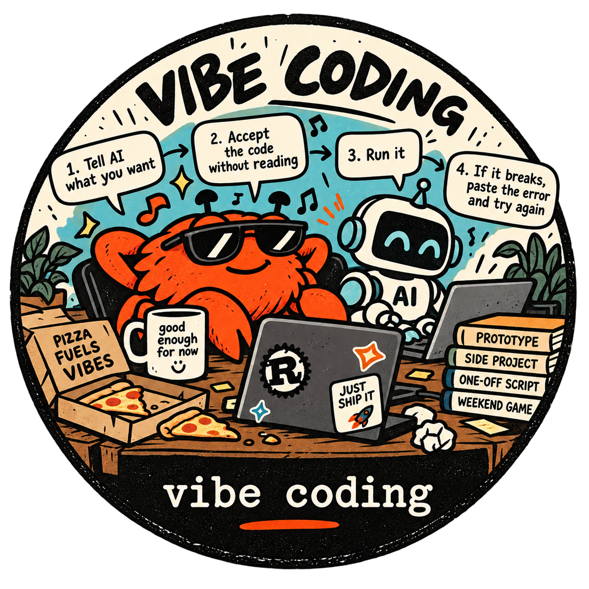

# Lesson 1: What is vibe coding?

<p align="center">
  <a href="vibe-coding-sticker.png">
    
  </a>
</p>

> Written in October 2026. AI tools change every month. Check whether what you read here still holds.

## The idea in one sentence

Vibe coding means letting an AI write code that you **accept without reading**. That's fine for things you'll throw away, and dangerous for anything people depend on.

## Where the word comes from

Andrej Karpathy, a well-known AI researcher, named it in February 2025. He described a new way of coding where you give in to the vibes and "forget that the code even exists". You tell the AI what you want, accept every change it makes, run the result, and when something breaks, you paste the error message back and let the AI fix it.

The word spread very quickly, because many people recognised what they were already doing.

## What it looks like

```text
   ┌─► describe what you want ("make the button blue and save the form")
   │          │
   │   AI changes the code ── you don't read the changes
   │          │
   │   run it ── does it seem to work?
   │          │
   └── no: paste the error back to the AI
       yes: done
```

The key part is the middle step: **the code is never read**. The only check is "does it seem to work when I try it".

## When vibe coding is fine

| Situation | Why it's OK |
|---|---|
| a prototype, to see whether an idea works at all | the code will be thrown away |
| a one-off script: rename 300 photos, convert a file | it runs once, and you can check the result with your own eyes |
| a personal toy or a weekend game | if it breaks, nobody else is hurt |
| exploring a library or API you don't know yet | you're learning what's possible, not building the product |

In all of these, **speed matters more than correctness**, and a mistake costs little.

## When vibe coding is dangerous

| Situation | What can go wrong |
|---|---|
| code that other people use | a bug that "seemed to work" for you breaks for them |
| money, personal data, passwords | a security hole nobody saw, because nobody read the code |
| code that must live for years | nobody understands it, so nobody can safely change it |
| code in a team | your colleagues have to maintain code that even you can't explain |

### Why it breaks down

- **"It seems to work" isn't "it works".** Trying the obvious case doesn't test the empty list, the huge number or the bad input. [Lesson 4](../04-why-you-still-need-to-know/) has examples that pass a quick try and still fail.
- **Fixes pile on fixes.** When the AI only sees an error message, it often fixes the *symptom*: it adds a special case, catches the error and ignores it, or clones data to silence a compiler error. After a few rounds the code is a tangle that works by accident.
- **The AI doesn't remember why.** In a new conversation, the AI knows only what it can read in the code. If nobody understood the code when it was written, nobody ever did.
- **The last 20% is the hard part.** Vibe coding gets you to "almost works" amazingly fast. Then the edge cases, the performance problem and the strange bug in production need someone who understands the code, and that person doesn't exist.

## Vibe coding isn't the same as using AI

This is the most important point of the lesson. **Using an AI isn't vibe coding.** Not reading what it wrote is.

You can let an AI write almost every line and still be a careful engineer: you decide what to build, you read every change, you test it, and you take responsibility for it. That's the subject of [Lesson 2](../02-ai-assisted-engineering/).

## A quick honesty test

Before you ship code an AI wrote, ask yourself:

1. Could I explain **every part** of this code to a colleague?
2. If a junior developer had written exactly this, would I approve it?
3. Do I know what happens with empty, huge or invalid input?

If the answer to any of them is "no", you're vibe coding. Decide whether that's OK **for this code**.

## What may change

AI models get better at writing correct code every year, so the line between "fine" and "dangerous" may move. The question "who understands this code, and who is responsible for it?" isn't going away.

Next: [Lesson 2: AI-assisted engineering](../02-ai-assisted-engineering/) · Back to the [course overview](../)
